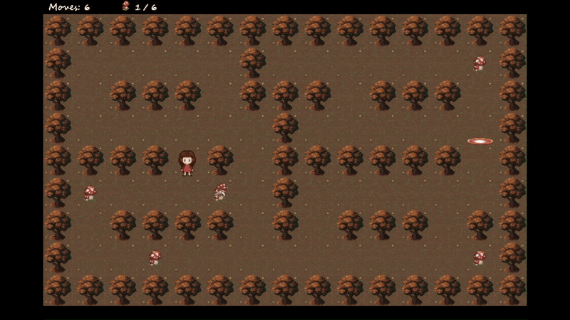

# So Long




### Overview

So Long is a small 2D game built in C using 42 school's graphical library MinilibX (X-Window). You must guide a little girl through a forest, collecting all the delicious mushrooms to unlock the exit. But beware of the vengeful mushroom monsters!

The project is part of the 42 curriculum and introduces students to the fundamentals of **graphic programming**, **game loop**, **event handling**, and **2D animation** in C.

---
### Features

* **Custom and customizable maps**.
* **Map validation and parser** using **flood-fill algorithm**.
* **Graphics**: Smooth rendering with **MinilibX**, a simple X-Window (X11R6) API in C.
* **Games stats (bonus)**: on-screen move counter and collectibles counter.
* **Sprite animation (bonus)**: animated walls and enemies.
* **Enemy patrols (bonus)**: animated mushroom monsters seeking to avenge their lost brethren.
* **Parser tester (extra)**: a set of invalid maps and a simple shell script to test the programme's parser.
* **Play mode (extra)**: a simple shell script which runs each valid map in a sequence of 5 levels.

---
### Game

#### Objective
Collect all mushrooms and reach the exit without getting caught by the enemies.

#### Controls

|   **Key**   | **Action** |
| ------------|:----------:|
|`W` or `↑` | Move up    |
|`A` or `←` | Move left  |
|`S` or `↓` | Move down  |
|`D` or `→` | Move right |
|`ESC` or `Q` | Quit game  |

---
### Map validation

* The map must be **rectangular**.
* The map must be **enclosed by walls**.
* The map can be composed of only **6 characters**:
  * `0` - empty space
  * `1` - wall
  * `P` - starting position
  * `E` - exit
  * `C` - collectible
  * `M` - enemy
* The map must contain **exactly 1 exit and 1 starting position** and **at least 1 collectible**.
* There must be a **valid path** from the starting position to the exit and to each of the collectibles.

**Example**
```
1111111111
1P00000C11
1011101011
1C00000E11
1000100C11
1111111111
```

---
### Installation

#### Requirements
* Linux with X11
* GCC
* make
* MinilibX (included)

```
git clone https://github.com/biertisch/so_long.git
cd so_long
make
```

---
### Usage

```
./so_long PATH/TO/MAP
```

Example:
```
./so_long maps/map2.ber
```

#### Play Mode
```
make play
```

#### Parser Tester
```
make test
```

---
### About 42

42 is a computer science school founded in Paris in 2013. It follows a project-based, peer-to-peer pedagogy focused on mid-level programming and algorithmic thinking.

---
### License & Contact

This repository is open for learning and reuse. Contributions, suggestions, and discussions are welcome — feel free to open an issue or reach out.